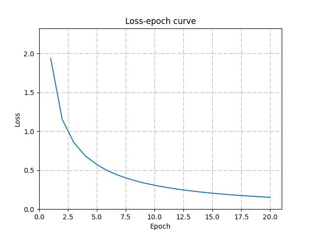

# GloVe-Python-Implementation
A simple implementation of GloVe model in Python (and PyTorch):  
[GloVe: Global Vectors for Word Representation](https://nlp.stanford.edu/projects/glove/)  

Firstly, prepare corpus. Take *text8* dataset as the example. To get vocabulary faster, I use [corpusit](https://github.com/kduxin/corpusit) to generate vocabulary.  

Compute co-occurrence matrix:  

	python3  scripts/vocab_cooc.py  -cp=data/text8  -m=50  -sp=cooc_matrix/text8_h5.hdf5

 
Train GloVe model:  

	python3 scripts/train.py -cp=cooc_matrix/text8_h5.hdf5 -p=saved_models/model_text8_512_adag_5e2.pt -ep=20
The Loss-epoch curve graph will be saved in logs, just like this:

Finally, you can use this code to validate GloVe loss computation:  
	
	pytest scripts/verify.py
